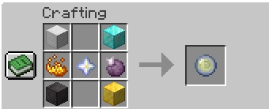

# 👑 Kingdoms of Origin: The Official Guide

Welcome to the **Kingdoms of Origin** server. This isn't just a survival world—it's a living history shaped by its players, its rulers, and the divine powers granted by the stars.

---

## 📋 Table of Contents

1. [🌍 The World: A Grand Scale](#the-world-a-grand-scale)
2. [👑 The King's Origin](#the-kings-origin)
3. [🧬 The Origins System](#the-origins-system)
   - [🌟 Your Awakening](#your-awakening)
   - [🔮 The Fall & The Orb](#the-fall--the-orb)
4. [🧬 Base Origins](#base-origins)
5. [⚡ Origins++](#origins)
6. [🌿 Extra Origins](#extra-origins)
7. [👾 Mob Origins](#mob-origins)
8. [🎙️ Simple Voice Chat](#simple-voice-chat)
9. [🗺️ Dynmap](#dynmap)
10. [🚗 Automobility](#automobility)
11. [🦎 Alex's Mobs](#alexs-mobs)
12. [⚒️ Orb of Origin — Crafting Recipe](#orb-of-origin--crafting-recipe)
13. [📦 Required Mods & Installation](#required-mods--installation)

---

## 🗺️ The World: A Grand Scale
Our world is a meticulously crafted **1:4500 scale recreation of the Earth**. Every continent, mountain range, and river exists at a scale that allows for true nation-building and strategic expansion. Whether you settle in the heart of Europe or the vast plains of the Americas, your surroundings are part of a global stage.

---

## 👑 The King's Origin
The ultimate power on the server is **The King** origin. 
- **Ascension:** Through the democratic election process (or interim appointment), one player is crowned King.
- **The Power:** Upon coronation, you are bestowed with **The King** origin, granting you god-like strength and control over your domain.
- **The Burden:** This power is temporary. Your reign is tied to your term in office.

#### ⚡ Royal Powers Include:
*   👑 **Royal Decree:** Grant Strength and Resistance to all nearby subjects.
*   ⚡ **Wrath of the King:** Call down lightning strikes on your enemies.
*   🪽 **Divine Flight:** Survey your kingdom with creative flight.
*   🛡️ **Crown's Resilience:** Massive boosts to health, armor, and movement speed.
*   ✨ **The Royal Mark:** A permanent glowing effect—the King cannot hide from their people.

---

## 🧬 The Origins System

In this realm, you are born with a legacy. Unlike standard servers, your path is defined by the stars from the moment you arrive.

### 🌟 Your Awakening
When you first join the server, you do not choose your identity. Instead, you are **granted an origin** by the server. This initial origin defines your early survival, granting you unique strengths and weaknesses that you must master to survive the 1:4500 world.

### 🔮 The Fall & The Orb
When your reign ends—whether through election, abdication, or forced removal—the divine power of the crown leaves you. 
- **The Gift:** Upon losing the King origin, you are granted an **Orb of Origin**.
- **Reshaping Destiny:** You can use this Orb to finally **pick** the origin you desire, allowing you to transition from a ruler back into a specialized member of society.

---

## 🧬 Base Origins

**Mod:** `Origins` by Apace100
Origins is the core mod that powers the entire origins system on this server. Each origin comes with unique **powers, buffs, and drawbacks**.

#### 🧍 Human
> *A regular human. Your ordinary Minecraft experience awaits.*
Standard Minecraft experience. **Impact:** None

#### 🐦 Avian
> *The Avian race has lost their ability to fly a long time ago. Now these peaceful creatures can be seen gliding from one place to another.*

| Type | Ability | Description |
|------|---------|-------------|
| ✅ | Featherweight | You fall as gently as a feather, unless sneaking |
| ✅ | Fresh Air | Your bed must be at Y ≥ 86 to sleep |
| ✅ | Like Air | Walking speed modifiers also apply while airborne |
| ✅ | Tailwind | Slightly faster on foot |
| ✅ | Oviparous | You lay an egg every morning upon waking |
| ❌ | Vegetarian | Cannot eat any meat |

**Impact:** Low

#### 🕷️ Arachnid
> *Their climbing abilities and the ability to trap their foes in spiderweb make the Arachnid perfect hunters.*

| Type | Ability | Description |
|------|---------|-------------|
| ✅ | Climbing | Climb any wall, not just ladders |
| ✅ | Master of Webs | Navigate cobwebs perfectly; trap enemies; craft cobwebs from string |
| ❌ | Carnivore | Can only eat meat — no vegetables |
| ❌ | Fragile | 3 fewer hearts than humans |

**Impact:** Low

#### 🪂 Elytrian
> *Often flying around in the winds, Elytrians are uncomfortable when they don't have enough space above their head.*

| Type | Ability | Description |
|------|---------|-------------|
| ✅ | Winged | Built-in Elytra wings — no need to equip |
| ✅ | Gift of the Winds | Every 30s, launch ~20 blocks into the air |
| ✅ | Aerial Combatant | Deal more damage while in Elytra flight |
| ❌ | Need for Mobility | Cannot wear heavy armor (above chainmail tier) |
| ❌ | Claustrophobia | Low ceilings weaken and slow you over time |
| ❌ | Brittle Bones | Extra damage from falling and flying into blocks |

**Impact:** Low

#### 🐚 Shulk
> *Related to Shulkers, the bodies of the Shulk are outfitted with a protective shell-like skin.*

| Type | Ability | Description |
|------|---------|-------------|
| ✅ | Hoarder | 9 extra inventory slots that persist through death |
| ✅ | Sturdy Skin | Natural armor even without equipped armor |
| ✅ | Strong Arms | Break natural stone without a pickaxe |
| ❌ | Unwieldy | Cannot hold a shield upright |
| ❌ | Large Appetite | Exhausts much quicker — must eat more often |

**Impact:** Low

#### 🐱 Feline
> *With their cat-like appearance, the Feline scare creepers away.*

| Type | Ability | Description |
|------|---------|-------------|
| ✅ | Acrobatics | Never take fall damage |
| ✅ | Strong Ankles | Jump higher while sprint-jumping |
| ✅ | Velvet Paws | Footsteps produce no vibrations (bypasses Sculk) |
| ✅ | Catlike Appearance | Creepers are scared of you; only explode if attacked first |
| ✅ | Nocturnal | Slight night vision when not in water |
| ❌ | Nine Lives | 1 fewer heart than humans |
| ❌ | Weak Arms | Can only mine stone if ≤ 2 adjacent stone blocks |

**Impact:** Medium

#### 🟣 Enderian
> *Born as sons and daughters of the Ender Dragon, Enderians are capable of teleporting but are vulnerable to water.*

| Type | Ability | Description |
|------|---------|-------------|
| ✅ | Teleportation | Throw ender pearls that deal no damage |
| ✅ | Slender Body | Extended reach on blocks and entities |
| ❌ | Hydrophobia | Take damage over time in water |
| ❌ | Scared of Gourds | Players wearing pumpkins are invisible to you |

**Impact:** Medium

#### 🌊 Merling
> *These natural inhabitants of the ocean are not used to being out of the water for too long.*

| Type | Ability | Description |
|------|---------|-------------|
| ✅ | Gills | Breathe underwater |
| ✅ | Wet Eyes | Perfect underwater vision |
| ✅ | Aqua Affinity | Break blocks underwater at normal speed |
| ✅ | Fins | Increased underwater speed |
| ✅ | Like Water | Don't sink unless you want to |
| ❌ | Gills (drawback) | Cannot breathe on land |

**Impact:** High

#### 🔥 Blazeborn
> *Late descendants of the Blaze, the Blazeborn are naturally immune to the perils of the Nether.*

| Type | Ability | Description |
|------|---------|-------------|
| ✅ | Fire Immunity | Immune to all fire damage |
| ✅ | Burning Wrath | Deal extra damage while on fire |
| ✅ | Hotblooded | Immune to poison and hunger effects |
| ❌ | Nether Inhabitant | Spawns in the Nether |
| ❌ | Hydrophobia | Take damage in water |

**Impact:** High

#### 👻 Phantom
> *As half-human and half-phantom offspring, these creatures can switch between a Phantom and a normal form.*

| Type | Ability | Description |
|------|---------|-------------|
| ✅ | Phantom Form | Switch between human and phantom form |
| ✅ | Phasing | Walk through solid blocks while phantomized |
| ✅ | Invisibility | Invisible while phantomized |
| ❌ | Photoallergic | Burns in daylight if not invisible |
| ❌ | Fast Metabolism | Phantomizing consumes hunger |
| ❌ | Fragile | 3 fewer hearts than humans |

**Impact:** High

---

## ⚡ Origins++

**Mod:** `Origins++` by TheQuantumXenon
Origins++ is a **massive expansion** adding over 100 new origins. Expect unique mechanics, custom bars, and multi-ability kits.

| Origin | Impact | Flavor | Notable Abilities |
|--------|--------|--------|-------------------|
| **Alien Axolotl** | ◉◉◉ | Crashed alien worshipper | Breathe underwater, 3-block tall, float when low HP |
| **Anomaly** | ◉◉◉ | Unstable ancient star energy | Teleport at will, weakened during day, no sleep |
| **Artificial Construct** | ◉◉◉ | Battery-powered machine | Coal-powered battery, built-in bow, iron nugget healing |
| **Automaton** | ◉◉◉ | Ancient machine walker | Dual fire/water bar system, elemental attacks, no death |
| **Beaver** | ◉◉ | Semi-aquatic rodent | Dolphin's Grace, haste near logs, mouth item storage |
| **Bedrockean** | ◉◉◉ | You are bedrock | Break bedrock, immune to drowning/starvation, extremely slow |
| **Binturong** | ◉◉ | Tree bear-cat | Camouflage, ride players, nocturnal night vision |
| **Bird** | ◉◉◉ | Tiny flying creature | Wing flap propulsion, double damage while flying |
| **Blazian** | ◉◉◉ | Upgraded Blazeborn | Blazing leap, fire charge barrage, lava swimming |
| **Blob** | ◉◉ | Unknown gooey entity | Side-step dash, health bar system, strange storage |
| **Boarling** | ◉◉ | Tough-skinned brawler | Hog-Wild rage at low HP, high base damage |
| **Broodmother** | ◉◉◉ | Elder spider matriarch | Wall climb, silky web trap, summon cave spiders |
| **Calamitous Rogue** | ◉◉ | Shadow assassin | Stealth system, ambush strike effects, marker teleport |
| **Candyperson** | ◉◉ | Sugar-addicted entity | Must eat sweet food, sugar effects, cake/cookie crafting |
| **Child of Cthulhu** | ◉◉ | Cthulhu descendant | Morph sizes, amphibious, extra reach |
| **Chimaera** | ◉◉◉ | Eldritch hunter | No oxygen need, bioweapon miasma, phase-shift teleport |
| **Cobra** | ◉ | Small poison snake | Poison on hit, poison arrow shot, 1-block tall |
| **Copper Golem** | ◉◉◉ | Living copper machine | Copper-eating diet, oxidation system, 12 hearts |
| **Corrupted Wither** | ◉◉◉ | Dragon-breath experiment | Warp dimension invulnerability, slow projectiles |
| **Craftsman** | ◉ | Artisan knight | Portable crafting table, fire immunity, village spawn |
| **Dark Mage** | ◉◉◉ | Evil magic user | Teleport 25 blocks, mana bar, disrupt spell — 5 hearts only |
| **Deathsworn** | ◉◉◉ | Necromancer | Summon minions, soul energy system, undead army |
| **Demi God** | ◉◉ | Half-divine warrior | Extra health, speed, phase through blocks briefly |
| **Deranged** | ◉◉ | Mentally unhinged human | Derangement bar, insanity mode, sword damage bonus |
| **Divine Architect** | ◉◉◉ | Universe builder | Dimensional teleport, universal energy blast, phase |
| **Dolphin** | ◉◉ | Aquatic jumper | Speed II in water, dolphin jump, pescatarian diet |
| **Drakonwither** | ◉◉ | Wither-Dragon hybrid | Wither immunity, shoot wither skulls |
| **Dullahan** | ◉◉◉ | Ancient death horseman | Binding chain bleed, nightmare steed, soul lantern diet |
| **Earth Spirit** | ◉◉◉ | Stone spiritual being | Phase through blocks, rock form transformation |
| **Ebon Wing** | ◉◉◉ | Winged blood hunter | Blood meter progression, unlock abilities by kills |
| **Emblazing Warrior** | ◉◉ | Nether chaos entity | Fury bar system, X-Slash attack, ignition on hit |
| **End Mage** | ◉◉◉ | Ancient end scholar | Mana bar, telekinesis, teleport 90 blocks — 8 hearts |
| **Enigma** | ◉◉ | Trickery being | Teleport behind targets, clone ability, stare to kill |
| **Fallen Angel** | ◉◉◉ | Hell escapee | Invisible elytra, wither skull shot — 8 hearts only |

> *...and 60+ more origins available in Origins++. Discover them on the origin selection screen.*

---

## 🌿 Extra Origins

**Mod:** `Extra Origins` by MoriyaShiine
Adds **5 new focused origins**. Requires Pehkui (installed).

#### 🌲 Floran
> *A plant-based being sustained by sunlight.*

| Type | Ability | Description |
|------|---------|-------------|
| ✅ | Photosynthesis | Satiated by sunlight exposure |
| ✅ | Plant Growth | Grow plants at the cost of hunger |
| ✅ | Water Strength | Gain Strength when exposed to water |
| ❌ | Flammable | Take twice as much damage from fire |
| ❌ | Restricted Diet | Can only consume honey bottles |

#### 🍄 Truffle
> *A fungal being with shifting magical spores.*

| Type | Ability | Description |
|------|---------|-------------|
| ✅/❌ | Magic Spores | Switch between Red Cap, Green Cap, or Blue Cap |
| ✅ | Mycelium Spread | Convert soil blocks to mycelium |
| ✅ | Mycelium Bonus | Standing on mycelium gives bonuses |
| ❌/✅ | Food Decomposition | Food nullifies status effects |

#### 🔨 Inchling
> *Tiny, agile, and surprisingly capable.*

| Type | Ability | Description |
|------|---------|-------------|
| ✅ | Wall Climbing | Climb any wall |
| ✅ | Light Body | Immune to thorns and velocity damage |
| ✅ | Slow Metabolism | Needs to eat less |
| ✅ | Jockey | Ride other players |
| ❌ | Tiny | Half the health of humans |

#### 🪙 Piglin
> *A Nether-born trader with gold-enhanced power.*

| Type | Ability | Description |
|------|---------|-------------|
| ✅ | Golden Mastery | Gold tools/armor deal more damage |
| ✅ | Crossbow Expert | 75% more damage with crossbows |
| ✅ | Piglin Truce | Piglins don't attack |
| ❌ | Nether Born | Spawns in the Nether |
| ❌ | Zombification | Zombifies outside the Nether |
| ❌ | Soul Fire Fear | Weakened near soul fire |

#### ⚛️ Nucleon
> *A being of pure radioactive unpredictability.*
3 random powers that decay into new ones over time.

---

## 👾 Mob Origins

**Mod:** `Mob Origins` by Allasidhe
Origins inspired directly by vanilla Minecraft mobs.

#### 🐝 Bee
- ✅ Flight, Pollination, Honey Collection
- ❌ Sting (death after use), Aquaphobia

#### 💀 Creeper
- ✅ Explosion on command, Charged by lightning
- ❌ Self-Destruction, Cat Fear, No Hands

#### 🧟 Zombie
- ✅ Undead (Immune to poison), Undying
- ❌ Burns in Daylight, Slow, Meat only

#### 🕷️ Spider
- ✅ Wall Climbing, Night Vision, Poison Bite
- ❌ Arthropod weakness, Reduced health

#### 💧 Drowned
- ✅ Aquatic Mastery, Trident Affinity
- ❌ Burns in Daylight, Slow on Land

#### 🦅 Phantom
- ✅ Flight, Night Strength
- ❌ Insomnia, Burns in Daylight

#### 🌸 Witch
- ✅ Potion Mastery, Potion Throwing
- ❌ Fragile, Water Vulnerability

#### 🪨 Silverfish
- ✅ Infest Blocks, Tiny Size, Call for Help
- ❌ Extremely Fragile, No Tools

---

## 🎙️ Simple Voice Chat
Adds **real-time proximity voice chat**.
- 🔊 Proximity Chat, Group Chat
- 🔑 Press **`V`** to open settings. Default PTT: **CAPS LOCK**.

---

## 🗺️ Dynmap
Provides a **live, browser-based map** of the entire server world.
- 🌐 View online players and world landmarks.
- 📍 Accessible via the server IP.

---

## 🚗 Automobility
Adds **fully functional, customizable cars**.
- 🔧 Build parts at the Auto Mechanic Table.
- 🏭 Assemble vehicles at the Automobile Assembler.
- 🏎️ Accelerate with `W`, Brake with `S`, Drift with `Space`.

---

## 🦎 Alex's Mobs
Adds **90+ new creatures** to the world.
- 🐅 Predators: Tigers, Orcas, Crocodiles.
- 🐘 Giants: Elephants, Cachalot Whales, Void Worms.
- 🐒 Companions: Raccoons, Capuchin Monkeys, Seals.

---

## ⚒️ Orb of Origin — Crafting Recipe
The Orb of Origin lets you **reset and re-select your origin**.

**Requirements:** 1x Nether Star, 4x Eye of Ender, 3x Diamonds.

---

## 📦 Required Mods & Installation

To experience the full features of the Kingdom, you must install the following mods from the `/mods` folder.

1. Download all `.jar` files from the [mods folder](file:///Users/ali/Documents/Origins-Plugin/Kingdoms%20Origin/mods).
2. Place them into your local `.minecraft/mods` directory.
3. Ensure you are running **Fabric Loader 0.15.0+** for Minecraft **1.20.1**.

---

## 🖼️ Gallery & Assets

---
*Documentation refactored for the Kingdoms of Origin Project. Maintainer: @USER*